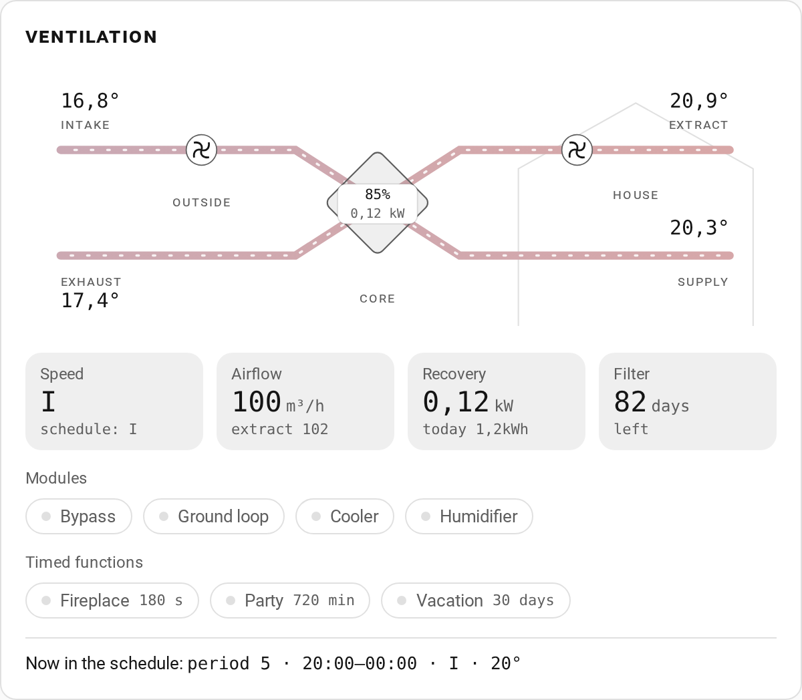
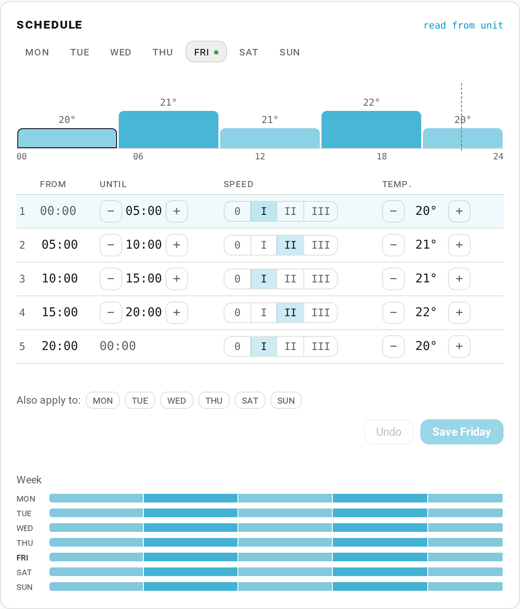
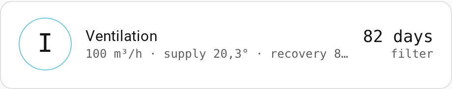
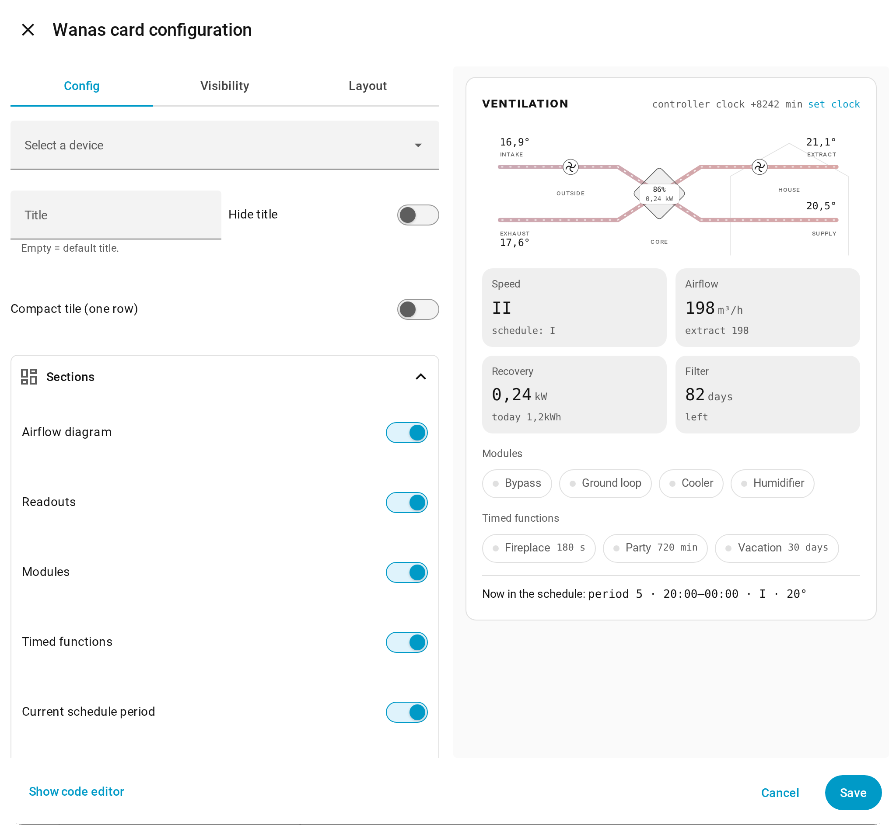
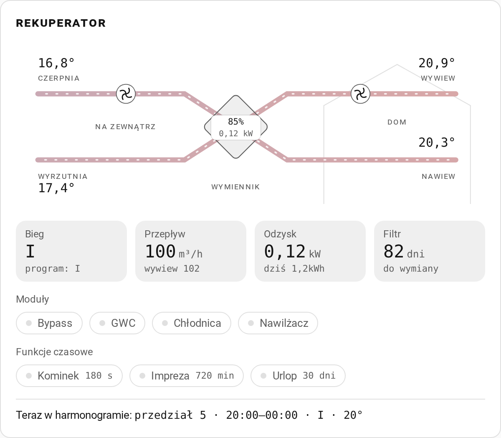

# Wanas heat recovery ventilator for Home Assistant

[](https://hacs.xyz/docs/faq/custom_repositories/)
[](https://github.com/jrx-code/hassio-integration-wanas/releases/latest)
[](https://github.com/jrx-code/hassio-integration-wanas/actions/workflows/validate.yml)
[](https://www.home-assistant.io/)
[](LICENSE)

Local control of a **Wanas** heat recovery ventilator (Combo 430/630 and relatives) over
**Modbus** (RTU over TCP, TCP or UDP): temperatures, airflow, heat recovery, filter, modules,
timed functions, the weekly schedule and the controller clock, plus two dashboard cards that
ship with the integration.

<table>
  <tr>
    <td width="50%" valign="top"></td>
    <td width="50%" valign="top"></td>
  </tr>
  <tr>
    <td colspan="2"></td>
  </tr>
</table>

## Contents

- [Features](#features)
- [Installation](#installation)
- [Configuration](#configuration)
- [Dashboard cards](#dashboard-cards)
- [Heat recovery](#heat-recovery)
- [Weekly schedule and controller clock](#weekly-schedule-and-controller-clock)
- [Entities](#entities)
- [Requirements](#requirements)
- [Troubleshooting](#troubleshooting)
- [Development](#development)

## Features

- **59 entities** on a fully equipped unit (65 with maxiCONTROL room panels), mapped to the
  manufacturer's register table: airflow, five temperatures, fan speeds, filter countdown,
  status flags, digital inputs, bypass, ground loop (GWC), humidifier, heater, cooler, the
  timed functions, fan setpoints, the weekly schedule and the controller clock.
- **Two dashboard cards** served by the integration itself: no Lovelace resource to add,
  full visual editors, English and Polish.
- **Heat recovery** power, efficiency and recovered energy, computed from readings already
  polled; the energy sensor works in the Energy dashboard.
- **Weekly schedule as the unit's panel shows it**: five periods a day with until times,
  speed and temperature, editable per day in the card or for the whole week with
  `wanas.set_schedule`.
- **Optional modules declared, not guessed**: heater, cooler, humidifier and maxiCONTROL
  entities are created only when fitted, and can be changed later without re-adding.
- **Safe on a shared RS485 bus**: one exchange at a time, reads of at most 16 registers,
  a 30 s deadline on every call, and a fresh connection after three failed polls.
- **English and Polish** names for every entity and the whole config flow.
- **Diagnostics** with the register bank, the read plan and the entity map (host redacted).

## Installation

### HACS (recommended)

The repository is not in the HACS default store yet, so add it as a custom repository:

1. HACS → three-dot menu → **Custom repositories**.
2. Repository `https://github.com/jrx-code/hassio-integration-wanas`, type **Integration**.
3. Find **hassio-integration-wanas** and download it. (A different integration in the store
   called "Wanas" uses the same `wanas` domain; do not install both.)
4. Restart Home Assistant.

### Manual

Copy `custom_components/wanas` into `config/custom_components/` and restart Home Assistant.

## Configuration

1. **Settings → Devices & services → Add integration → Wanas**.
2. Connection:

   | Field | Default | |
   |---|---|---|
   | Host | | IP address of the Modbus gateway |
   | Port | `502` | |
   | Slave ID | `1` | |
   | Protocol | `rtu_over_tcp` | `rtu_over_tcp`, `tcp` or `udp` |

3. Tick only the modules the unit actually has. The controller answers on the heater,
   cooler and humidifier registers whether or not they are fitted, so presence cannot be
   probed. An unticked module never gets entities:

   | Module | Entities skipped |
   |---|---|
   | Heater | heater state, heater switch, heater days |
   | Cooler | cooler state, cooler switch, cooler days |
   | Humidifier | humidifier state, humidifier switch |
   | maxiCONTROL room panels | room and bathroom 1/2 temperature and humidity |

4. The connection is tested before the entry is saved.

Everything can be changed later under **Configure** on the integration card, including the
polling interval (5 to 600 s). Turning a module off removes its entities instead of leaving
them unavailable.

### Custom register addresses

For firmware with a different register map, tick **Show advanced configuration** on the
first form, or later **Reconfigure register addresses and names** under **Configure**. Every
address and name can be changed. Only values that differ from the defaults are stored, so
untouched registers keep following the built-in map when a release corrects it.

## Dashboard cards

The integration registers both cards itself. After installing or updating, reload the
browser, then **Edit dashboard → Add card → By card** and search for **Wanas**.

| Card | |
|---|---|
| **Wanas** (`custom:wanas-card`) | The airflow through the unit: duct colours follow the air temperature, the dashes move at the fan speed, an open bypass reroutes the supply past the core, and the core shows recovery efficiency and power. Below: speed (with a note when a digital input overrides the schedule), airflow, recovered power with today's energy, filter days, modules, timed functions with their countdown, and the current schedule period. |
| **Wanas** compact (`compact: true`) | One row: speed, airflow, supply temperature, recovery, filter. |
| **Wanas schedule** (`custom:wanas-schedule-card`) | One day as a 24-hour timeline (bar height is the speed, the number the temperature) and the five-period table. Edits follow the unit's rules; one save can write several days. A week overview below. |

Both have a visual editor, so nothing needs typing. Only options you change are saved.



### Card options

`wanas-card`

| Option | Default | |
|---|---|---|
| `device_id` | first unit | which Wanas device |
| `title`, `hide_title` | "Ventilation" / "Rekuperator", `false` | header text, or no header |
| `compact` | `false` | one-row tile |
| `show_diagram`, `show_readouts`, `show_modules`, `show_timed`, `show_now`, `show_clock` | `true` | sections: airflow diagram, readout tiles, module chips, timed functions, current schedule period, clock drift line |
| `readouts` | all | any of `speed`, `airflow`, `recovery`, `filter` |
| `modules` | all fitted | any of `bypass`, `gwc`, `heater`, `cooler`, `humidifier` |
| `timed` | all | any of `fireplace_switch`, `party_switch`, `vacation_switch` |
| `filter_warning_days` | `7` | the filter tile turns amber at or below this |
| `animate` | `true` | moving air and fans |

`wanas-schedule-card`

| Option | Default | |
|---|---|---|
| `device_id` | first unit | which Wanas device |
| `title`, `hide_title` | "Schedule" / "Harmonogram", `false` | header text, or no header |
| `read_only` | `false` | values only, no steppers and no save |
| `show_timeline`, `show_table`, `show_week`, `show_reload` | `true` | timeline, period table, week overview, "read from unit" button |
| `start_day` | `today` | or `monday` ... `sunday` |

```yaml
type: custom:wanas-card
title: Ventilation
readouts: [speed, airflow, recovery]
show_timed: false
```

Notes:

- Both cards find their entities through the entity registry, so renamed entity ids keep
  working. With more than one unit, pick the device in the editor.
- Layout follows the card's own width, not the screen's: readouts drop to two columns and
  the schedule table hides its "from" column (always the previous row's "until") when narrow.
- The animation runs at 10 frames per second and stops while the card is off screen, the tab
  is hidden or the system asks for reduced motion.
- Colours come from the theme; the Polish texts follow the user's language.

<details>
<summary>The same card in Polish</summary>



</details>

## Heat recovery

Three sensors computed from registers the integration already reads, with no extra bus
traffic:

| Sensor | Unit | |
|---|---|---|
| Heat recovery power | W | `0.335 × supply airflow [m³/h] × (supply − outdoor) [K]`; 0.335 is air density 1.2 kg/m³ × specific heat 1005 J/(kg·K) per hour |
| Heat recovery efficiency | % | `(supply − outdoor) / (room − outdoor)`, the supply-side temperature ratio of EN 308; unknown when room and outdoor differ by less than 2 K |
| Recovered energy | kWh | the power integrated on every poll, `total_increasing`, kept across restarts |

- In summer, with the outdoor air warmer than the room, the core recovers cooling: power
  stays positive and the `mode` attribute reads `cooling`. Supply air warmer than a warm
  outdoor is fan heat and counts as 0.
- With the bypass open or the heater, cooler or ground loop running, the supply temperature
  no longer measures the core alone: power and efficiency are unknown and nothing is added
  to the energy. A sensor fault (63066, read as −247 °C) does the same.
- The supply side also picks up the supply fan's motor heat, so it reads higher than the
  extract side, which is in the `extract_side_power` attribute. On a Combo 430 at 396 m³/h,
  15.4 °C outside and 24.1 °C inside, the two were 822 W and 547 W.

## Weekly schedule and controller clock

The unit's panel calls this **Programy** (the manual: *harmonogram tygodniowy*). Each day has
five periods with an until time, a fan speed and a temperature. Period 1 starts at 00:00 and
period 5 ends at 00:00, so four times are set, each the end of one period and the start of
the next.

The controller keeps a separate schedule for each day but shows one at a time: register 8
selects the day, and registers 10 to 23 read and write it. Register 8 is **not** the current
weekday (checked on a Combo 430: with Saturday selected, period 1 speed changed on Saturday
only).

| Entity | Register | English | Polish |
|---|---|---|---|
| `select` | 8 | Schedule day | Harmonogram: dzień |
| `time` | 10-13 | Period 1-4 until | Przedział 1-4: do godziny |
| `number` | 14-18 | Period 1-5 fan speed | Przedział 1-5: bieg |
| `number` | 19-23 | Period 1-5 temperature | Przedział 1-5: temperatura |
| `sensor` | 8, 10-23 | Schedule (selected day) | Harmonogram (wybrany dzień) |
| `sensor` | | Current schedule period | Bieżący przedział harmonogramu |
| `button` | 50, 51 | Set clock from Home Assistant | Ustaw zegar z Home Assistant |

- Period entities act on the day the **Schedule day** select shows; changing the select does
  not change what the unit runs today.
- Until times must be on the quarter hour, between 00:15 and 23:45, after the previous
  period's end and before the next one's. Anything else is rejected with a message saying
  why; nothing is rounded.
- The integration keeps the whole week in memory: read at start-up and daily at 03:17, and
  kept up to date by every poll and every write. The cards and the **Current schedule
  period** sensor use it without extra bus traffic.

### Services

```yaml
# Read all seven days: {monday: {periods: [{from, until, speed, temperature}, ...]}, ...}
action: wanas.get_schedule
data:
  refresh: true          # optional: read the unit instead of the in-memory copy
response_variable: week

# Write whole days, one row per period, like the panel's table
action: wanas.set_schedule
data:
  days: [monday, tuesday, wednesday, thursday, friday]
  periods:
    - {until: "06:00", speed: 1, temperature: 18}
    - {until: "07:00", speed: 2, temperature: 20}
    - {until: "14:00", speed: 1, temperature: 20}
    - {until: "15:00", speed: 3, temperature: 20}
    - {speed: 1, temperature: 18}        # period 5 runs to midnight
```

Both hold the bus for the whole exchange and put register 8 back. All five periods are
required; speeds are 0 to 3, temperatures 10 to 30 °C. Pass `config_entry_id` only when more
than one unit is set up.

### Controller clock

Local wall time: date `day<<11 | month<<7 | (year-2000)` in register 50, time
`hour<<8 | minute` in register 51 (the DTR's `hour<<7` example does not match the unit). It
drifts by minutes per week and the schedule runs on it, so it is exposed as a timestamp
sensor with a button that sets it from Home Assistant.

## Entities

59 on a fully equipped unit: 17 sensors, 10 binary sensors, 8 switches, 18 numbers, 4 times,
1 select, 1 button. maxiCONTROL adds 6 sensors. Names are translated; the Polish column is
what a Polish instance shows.

### Sensors

| Register | English | Polish |
|---|---|---|
| 0 | Supply airflow | Wydatek nawiewu |
| 1 | Exhaust airflow | Wydatek wywiewu |
| 2 | Supply fan speed | Bieg nawiewu |
| 3 | Exhaust fan speed | Bieg wywiewu |
| 4 | Outdoor temperature | Temperatura zewnętrzna |
| 5 | Exhaust temperature | Temperatura wyrzutowa |
| 6 | Supply temperature | Temperatura nawiewu |
| 7 | Room temperature | Temperatura pomieszczenia |
| 29 | Extra probe temperature | Temperatura dodatkowa |
| 36 | Filter replacement | Wymiana filtra |
| 37 | System errors | Błędy systemu |
| 50, 51 | Controller clock | Zegar sterownika |
| 0, 4, 6, 7 | Heat recovery power, efficiency, recovered energy | Moc odzysku ciepła, Sprawność odzysku ciepła, Energia odzyskana |
| 55-57 | Room / bathroom 1 / bathroom 2 humidity (maxiCONTROL) | Wilgotność w pokoju / łazience 1 / łazience 2 |
| 65-67 | Room / bathroom 1 / bathroom 2 temperature (maxiCONTROL) | Temperatura w pokoju / łazience 1 / łazience 2 |

Registers 55 to 57 and 65 to 67 come from a user's working Modbus setup (issue #1); the
manufacturer table in `config/hardware/` ends at register 54. Schedule sensors are listed
under [Weekly schedule](#weekly-schedule-and-controller-clock).

### Binary sensors

| Register | English | Polish |
|---|---|---|
| 30 | Ground heat exchanger | Stan GWC |
| 31 | Bypass | Stan bypassu |
| 32 | Humidifier | Stan nawilżacza |
| 33 | Heater | Stan nagrzewnicy |
| 34 | Cooler | Stan chłodnicy |
| 35 | Vacation mode | Tryb urlopowy |
| 46 | Speed 1 input | Wejście biegu 1 |
| 47 | Speed 3 input | Wejście biegu 3 |
| 48 | Hood input | Wejście okapu |
| 49 | Fire alarm input | Wejście przeciwpożarowe |

Registers 46 to 49 are the controller's read-only digital inputs.

### Switches

| Write → verify | English | Polish |
|---|---|---|
| 38 → 30 | Ground heat exchanger | GWC |
| 39 → 31 | Bypass | Bypass |
| 40 → 32 | Humidifier | Nawilżacz |
| 41 → 33 | Heater | Nagrzewnica |
| 42 → 34 | Cooler | Chłodnica |
| 43 → 35 | Vacation (30 days) | Urlop (30 dni) |
| 44 → 44 | Fireplace (3 min) | Kominek (3 min) |
| 45 → 45 | Party (12 h) | Impreza (12 h) |

The last three are one-tap timed functions: on writes the longest duration the register
takes, off writes 0, and the switch stays on while the counter runs down. The numbers below
set any other duration.

### Numbers

| Register | Range | Unit | English | Polish |
|---|---|---|---|---|
| 41 | 0 to 180 | days | Heater days | Nagrzewnica (dni) |
| 42 | 0 to 180 | days | Cooler days | Chłodnica (dni) |
| 43 | 0 to 30 | days | Vacation days | Tryb urlopowy (dni) |
| 44 | 0 to 180 | s | Fireplace | Funkcja kominek |
| 45 | 0 to 720 | min | Party | Funkcja impreza |
| 52-54 | 1 to 1600 | % or m³/h | Fan power/flow 1-3 | Moc/przepływ biegu 1-3 |

- The day unit is translated, so the interface shows "days" or "dni" by the user's
  language; templates see the English `days`.
- Registers 52 to 54 hold fan power in percent, or the airflow in m³/h when the unit runs in
  constant-flow mode. The manufacturer table gives 1 to 100 %, but a Combo 430 in flow mode
  reads 100, 200 and 400, so the numbers accept up to 1600 and carry no unit.
- Registers 41 and 42 are day counters (0 to 180, DTR Combo 430/630, 04.2026); the heater and
  cooler switches write 1, arming them for a day.

### No fan or climate entity

No register sets the fan speed: registers 2 and 3 report it, 46 and 47 are read-only inputs,
and the speed comes from those contacts or the weekly schedule. A `fan` entity could only fake
it by rewriting the active period, silently editing the schedule. Likewise there is no
supply-air target temperature for a `climate` entity, only the per-period setpoints.

## Requirements

- **Home Assistant 2024.12 or newer** (translated units for the day counters; the advanced
  register step also needs `data_entry_flow.section` from 2024.7).
- **pymodbus 3.10 or newer**, installed automatically (3.10 renamed `slave=` to `device_id=`).
- Network access to the unit's Modbus gateway. Only one Modbus master should talk to it: a
  transparent RS485 gateway passes every reply to every connected client.

## Troubleshooting

**Cannot connect to the device**
- Check the gateway answers (`ping`, port 502 open) and the slave ID.
- Try another protocol; some gateways expect plain TCP rather than RTU over TCP.

**Readings stop updating**
- Every bus call has a 30 s deadline; a call that never returns is abandoned, the socket is
  closed and the next poll reconnects. After three failed polls in a row the connection is
  opened afresh. Diagnostics show `failed_polls_in_a_row` and `last_poll_success`.
- Make sure nothing else polls the same gateway.

**A sensor shows Unknown**
- Some variants do not implement every register; remap or ignore it in the advanced step.
- Heat recovery is unknown by design while the bypass, heater, cooler or ground loop runs.

**The card is missing or old after an update**
- Reload the browser without cache (Ctrl+Shift+R); in the companion app, reload or restart it.

## Development

```bash
python3 -m venv .venv
.venv/bin/pip install pytest pytest-cov pytest-homeassistant-custom-component "pymodbus>=3.10"
.venv/bin/python -m pytest
```

73 tests with 95 % coverage: config and options flows, migration, module gating, read
blocking, bus serialisation and deadlines, schedule periods and services, the clock, heat
recovery and the served cards. CI runs Hassfest, HACS validation, Ruff and pytest.

Translations live in `custom_components/wanas/translations/` (English and Polish, 65 entity
names); a new language is one file with the keys of `strings.json`. The cards are plain web
components in `custom_components/wanas/www/wanas-cards.js`, no build step.

## License

MIT, see [LICENSE](LICENSE). Made by **JI ENGINEERING**.
